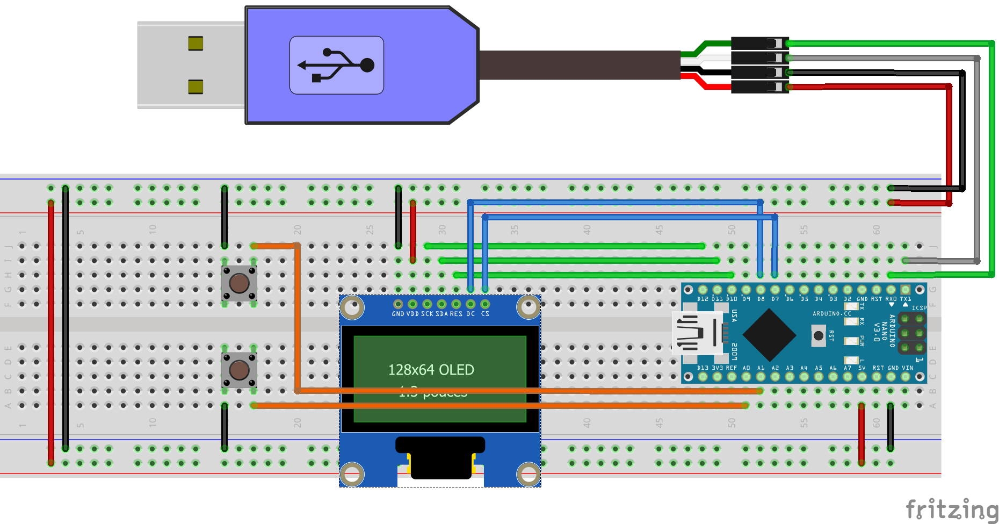
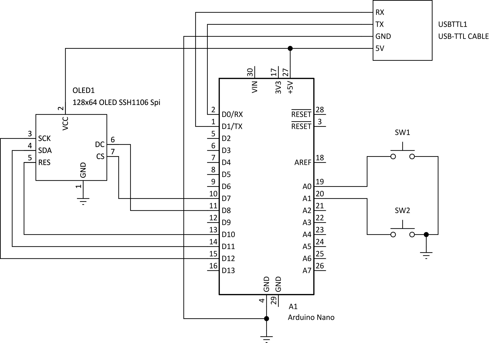

# arduino-pong

A simple pong game for Arduino compatible boards.

# Parts

* Push Button x2
* 128x64 OLED Display (SSH1106, Spi interface)
* Arduino Nano (Or any other compatible board)
* Jumper Cables and a Breadboard (Duh!)

If you have a different type of display, it shouldn't be too difficult to tweak the code around to accomodate it. Everything you'll need to change is within the `arduino-pong.ino` file.

# Schematics

I have my arduino the wrong way around because I don't have the proper cable for programming it. Instead, I used a ttl to uart cable to program it. Having the board in this configuaration made it a tad bit more convenient. Anyways, if you have the proper cable you can completely ignore the ttl cable parts of the schematics :D.

Here's schematic diagram in case that's your cup of soup. No judgements here, I also prefer these over the pictorial diagrams. I'm just not very good at making them... Yet!

# Installation

Open the `arduino-pong.ino` file in the Arduino IDE. The project depends on the `Adafruit_GFX` and `Adafruit_SH110X` libraries so make sure you have those installed. The only step left over is to hit upload :D.

# Challenges

TODO