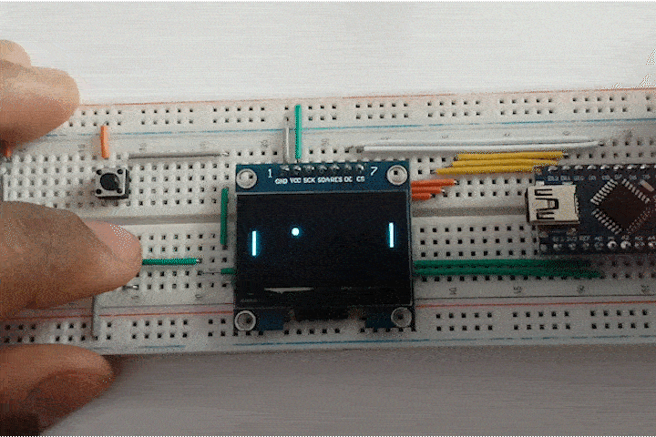

# Arduino pong

A simple pong game for Arduino compatible boards.
Like most of my projects, this was created as a learning exercise.
Firstly, for learning how to use displays with Arduinos and
secondly to get used to making larger projects with C++.
Anyways, here's a small clip of the project.

Let's pretend you can't see my finger shaking. Oh, what's that? You can't unsee it now? Damn! :joy:

## Parts

* Push Button x2
* 128x64 OLED Display (SSH1106, Spi interface)
* Arduino Nano (Or any other compatible board)
* Jumper Cables and a Breadboard (Duh!)

If you have a different type of display, it shouldn't be too difficult to tweak the code around to accomodate it. Everything you'll need to change is within the `arduino-pong.ino` file.

## Schematics

I have my arduino the wrong way around because I don't have the proper cable for programming it. Instead, I used a ttl to uart cable to program it. Having the board in this configuaration made it a tad bit more convenient. Anyways, if you have the proper cable you can completely ignore the ttl cable parts of the schematics :D.

Here's schematic diagram in case that's your cup of soup. No judgements here, I also prefer these over the pictorial diagrams. I'm just not very good at making them... Yet!

## Installation

Open the `arduino-pong.ino` file in the Arduino IDE. The project depends on the `Adafruit_GFX` and `Adafruit_SH110X` libraries so make sure you have those installed. The only step left over is to hit upload :D.

## Challenges

The biggest challenge was trying to improve the frame rate of the project.
I tried multiple different methods of trying to decrease/optimize draw operations.
At first I was clearing objects as they move (this is cheaper than clearing the entire screen on each frame),
but this resulted in very inconsistent results.
The game would run at different frame rates depending on the balls position relative to the paddles.
I ended up opting for clearing the entire screen on each frame, because it has a more steady frame rate.

Another challenge was from me not knowing the landscape very well.
What I mean is that, I was coding for a platform with very limited resources. So, I have not doubt there are tons of optimizations that can be made to the code.

Also, I was trying to stay away from classes but I just ended up using namespaces in a way that mimics having classes. I don't think that's how namespaces should be used. Oh well, this was at least not the worst attempt at coding for micro-controllers. (I think I could have done worse :D)
